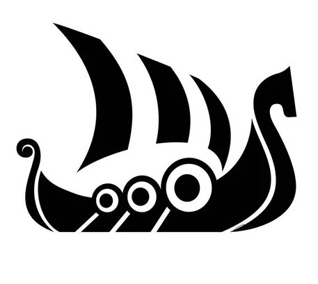

- #organizace
- Vesnický cech Vlnotvorců je větší spolek rozprostřený po hned několika vsích a menších městečkách na Mečovém pobřeží, severně od [Slaniska](Slanisko).
- Cech se zabývá stavbou lodí od A do Z a jsou tedy v jeho řadách všichni od kovářů, řezbářů, truhlářů až po tkalce. Součástí je také [[Orbin Vlček]], který se zajímá hlavně o vyřezávání přídí, a jeho mistr.
- Zrovna šikovných řezbářů však mají Vlnotvorci aktuálně nedostatek a tak je Orbinovo náhlé zmizení velmi zaskočilo, jelikož by u nich měl rozhodně o práci postaráno.
- V případě, že by Orbina našli, rozhodně by se pokusili dostat ho zpět do svých řad. A to i kdyby bylo potřeba ho pro tyto účely tahat z nějakých ne až tak závažných potíží.
- {:height 415, :width 452}