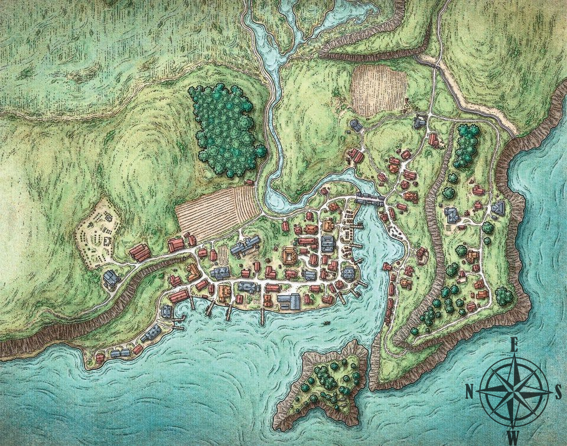
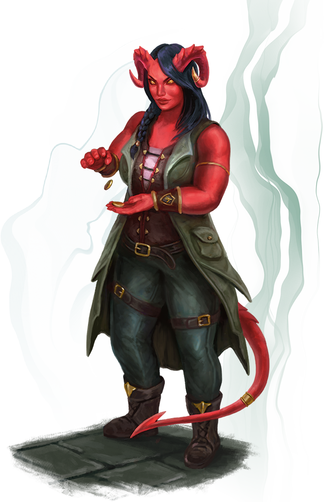

- #místo #město
- Slanisko je menší rybářské městečko nacházející se na Mečovém pobřeží mezi Letohradem a Hlubinou. Je hlavním místem, ve kterém se odehrává příběh dobrodružství [[Duchové Slaniska]].
- Obyvatelé, kteří jsou převážně lidé, činí celkem několik tisíc. Menšinu obyvatelstva pak také tvoří trpaslíci.
- Královská správa jej často zanedbávala a tak se místní obyvatelé naučili žít a čelit hrozbám docela samostatně. Na pevnině se nachází špatně prostupné močály či hvozdy. Z moře zas útoky otrokářů. Ty už jsou díky zásahu královského loďstva minulostí. Ale jiné kriminální činnosti se pořád daří.
- Stejně tak se ale daří obchodu a rybolovu. Nedávno se zde i usadili trpaslíci a začali těžbu v nedalekých kopcích.
- Nově prosperující Slanisko vzbudilo zájem koruny, k nelibosti některých místních, kteří nemají rádi změny místních poměrů. Tito Tradicionalisté jsou zejména starousedlíci. Mají strach i z dalšího otevřeného konfliktu s otrokářskými silami, do kterého si myslí, že je   království zatáhne.
- Oproti nim Loajalisté jsou spíše nový obyvatelé, kteří například zbohatli na obchodu a zejména nový důl se jim zamlouvá. Spíše se zajímají o blaho království než o místní region.
-
- # Místa
	- {:height 625, :width 836}
	-
	- ## Žraločí most
	  id:: 6572ee5e-9793-43d9-a3be-43f98af6fca5
		- Místními nazývaný často *Žraločák* je most přes záliv, který spojuje hlavní část města s jeho jižnější částí.
		- Most je asi 2 sáhy nad vodou a ze solidního kamene, který vypadá o mnohem starší než kamen použitý ke stavbě všech domů ve Slanisku. Nejspíše jde o nejstarší strukturu celého města.
		- Na mostě se trvale usídlilo několik obchodníků, kteří kolemjdoucím nabízejí vše možné. Místí ale varují, že jde o předražené zboží, které se nevyplácí kupovat.
		- Jak si je většina obyvatel vědoma, elfské rase se při přechodu Žraločáku dělá ze záhadných důvodů špatně. Po bližším prozkoumání kouzlem *detekuj magii* je zřejmé, že důvodem je nějaké velmi staré kouzlo vycházející z celého mostu.
		- Historii Žraločáku se snažil rozluštit místní vůdce [hlídky](6572ee5e-a7c1-4e24-a71f-527556701aac) [[Eliander]], zatím si však není jistý ničím víc, než že je most starý více než 500 let a že byl proklet nejspíše z důvodu obrany proti velkému útoku na Slanisko.
		- Na Žraločáku má obchůdek i šikovný truhlář, který velmi zaujal [Orbina](Orbin Vlček), a bláznivý bylinkář, který je schopen koupit cokoliv, pokud je to spojeno s poutavým příběhem.
	-
	- ## Radní síň
		- Radní síň je velká budova umístěná u vnitřních doků Slaniska.
		- Jde o sídlo samotné rady Slaniska.
		- Budova má modře natřenou střechu a stěny, okna byla však nechána bílá.
		- U vchodu do Radní síně všechny příchozí přivítá recepční Eleanus, který je vzhledem ke své pozici až moc velká drbna.
	-
	- ## Přetržená udice
		- Jedno z významných míst ve Slanisku je právě rodinný podnik zvaný Přetržená udice.
		- Jde o hospodu stojící východně hned vedle Radní síně. Budova má podivný vzhled, jelikož je poskládaná z jednotlivých kusů lodí.
		- Hospoda nabízí exkluzivní specialitu ve formě klepítkového vína, také zvaného klepítkovka. Cena tohoto vína je ve výši 3 st. za sklenku. Jde o silnou formu vína, jejíž obsah alkoholu je asi 18 %.
		- **Hana Rystová** je jednou z členů rodiny vlastnící Přetrženou udici. V hospodě pracuje většinou jako servírka nebo hostinská. *Lze ji považovat za slušně vypadající ženu s hodnocením 7,5/10.*
		- Přetrženou udici pravidelně navštěvuje Donil se svou bandou. Je to jeden z mužů, kteří se odvážili přiblížit k tajemnému [alchymistově domu](Alchymistův dům).
	-
	-
	- ## Prázdná síť
		- Další z hospod ve Slanisku je Prázdná síť. Jde však o podnik pochybných kvalit.
		- Budova stojí na kůlech v blízkosti městských doků.
		- Po [Kiviorově](Kivior) čarovných kouscích s vyprazdňováním korbelů, zde nemají skupinu dobrodruhů velmi v oblibě. Bylo jim dokonce vyhrožováno smrtí, jedním ze štamgastů.
	-
	- ## Proutěná koza
		- Proutěná koza je poslední z hospod operujících ve Slanisku. V tomto podniku se schází primárně trpaslická menšina žijící v tomto městě.
		- Jde o trochu noblesnější podnik.
	-
	- ## Luzovi svědomití ubytovatelé
		- Velmi rušná budova plná různých podnikatelů a obchodníků, kteří se zabývají všemi možnými záležitostmi.
		- Nachází se na jižnější straně města, hned za Žraločím mostem. Je to větší budova s oranžovou střechou.
		- **Kapitánka Xendros** je silnější tieflingská obchodnice s magickými předměty. Je schopna sehnat prakticky cokoliv, ačkoliv u některých předmětů může trvat až několik týdnů, než dorazí do Slaniska.
		- {:height 385, :width 246}
		- **Xerxes** je podivín, který by byl ochoten koupit velmi podivné věci. Od dobrodruhů byl ochoten koupit dokonce i zlaté žebro, jelikož ho zrovna hledal.
	-
- # Organizace Slaniska
	- Slanisko je primárně závislé na své vlastní správě. Její hlavní jednotkou je samotná rada Slaniska.
	-
	- ## Rada Slaniska
	  id:: 6572ee5e-e2bd-459b-9d8c-fb7c26a84f29
		- Rada se zaobírá samotným řízením Slaniska z organizačního hlediska, řešením jeho problémů, financí a tak dále. Skládá se z pěti členů, kterými aktuálně jsou [[Melistráda Zákles Měďná]], [[Eda]], [[Gelan]], [[Eliander]] a [[Anders Solmor]].
		- Ohledně případného spojenectví s ještěrci sídlící v nedaleké [jeskyni](Ještěrecká jeskyně) nebyla rada úplně jednotná. Po audienci s [Morginem](Morgin) se však rozhodli vyslat [Anderse Slomora](Anders Solmor) spolu s částí městské hlídky na vyjednávací misi.
		- Zároveň se rada usnesla, že si skupina dobrodruhů za pročištění [alchymistova domu](Alchymistův dům) po prověření [Elianderem](Eliander) zaslouží svou slíbenou odměnu 100 zl. větší odměny se skupina už ani nedožadovala.
	-
	- ## Hlídka Slaniska
	  id:: 6572ee5e-a7c1-4e24-a71f-527556701aac
		- Vzhledem k velkému přílivu obchodníků do Slaniska je velký nápor také na městskou hlídku, která je nucena tento proud na městských hradbách řídit. Stejně tak je ale jejich samozřejmým úkolem zajišťovat bezpečí a klid v ulicích Slaniska
		- Vůdcem této hlídky je jeden z členů rady [[Eliander]].
-
- # Problémy ve Slanisku
	- DONE **[Alchymistův strašidelný dům](Alchymistův dům)** - Obyvatelé Slaniska se bojí přiblížit ke starému domu asi hodinu severně od města. V domě podle svědků straší a dějí se tam další záhady. Nikdo se neodváží k domu více přiblížit, jelikož ti, co se odvážili, se už nevrátili. [[Anders Solmor]] nabízí za vyřešení této záhady minimálně 100 zl.
	  :LOGBOOK:
	  CLOCK: [2023-12-02 Sat 12:32:27]--[2023-12-02 Sat 12:32:27] =>  00:00:00
	  CLOCK: [2023-12-02 Sat 12:32:28]--[2023-12-02 Sat 12:32:29] =>  00:00:01
	  CLOCK: [2023-12-02 Sat 12:32:33]--[2023-12-02 Sat 12:32:36] =>  00:00:03
	  CLOCK: [2023-12-02 Sat 12:32:43]--[2023-12-02 Sat 13:00:50] =>  00:28:07
	  CLOCK: [2023-12-02 Sat 13:00:51]--[2023-12-08 Fri 10:17:04] =>  141:16:13
	  :END:
	- DOING **Pašeráci** - Ve Slanisku se v poslední době velice rozmohla pašerácká aktivita. [Orbin](Orbin Vlček) si je jistý, že jde o něco společného se [Skerrinem](Skerrin). [[Keledek Mlčící]] tvrdí, že to tak rozhodně je.
	  :LOGBOOK:
	  CLOCK: [2023-12-02 Sat 12:32:10]--[2023-12-02 Sat 12:32:10] =>  00:00:00
	  CLOCK: [2023-12-02 Sat 12:32:11]--[2023-12-02 Sat 12:32:11] =>  00:00:00
	  CLOCK: [2023-12-02 Sat 12:32:11]--[2023-12-02 Sat 12:32:12] =>  00:00:01
	  CLOCK: [2023-12-02 Sat 12:32:13]
	  CLOCK: [2023-12-08 Fri 10:17:16]
	  :END:
	- DONE **Hledání ztracené lodi** - Bohatý obtloustlý obchodník (možná třeba taky pašerák?) [[Aubreck Drallion]] očekával, že do [Slaniska](Slanisko) připluje loď zvaná [[Císař vln]], která měla vézt cenné papíry. Jelikož však nepřiplula, hledá schopnou posádku, která by loď našla a případně zachránila. Na výpravu byla sehnána loď [[Duše zimy]] spolu s posádkou.
	  :LOGBOOK:
	  CLOCK: [2023-12-08 Fri 10:17:27]
	  CLOCK: [2023-12-08 Fri 10:17:38]
	  :END:
	- DONE **[[Skuruti v Zenopově věž]]** - K [Miguelovi](Miguel) se doneslo, že na východ od slaniska jsou u řeky staré opuštěné ruiny věže, kde by se mohli ukrývat skuruti, jenž ukradli jeho milovanou Kaňku.
	- TODO **Nekromatné na ostrově** - Podle hlášení, která se dostala k [Andersi Solmorovi](Anders Solmor), se na blízkém ostrově se objevila nejspíše skupina nektomantů. Chtěl by, aby se na to někdo podíval a zjistil, co se tam doopravdy děje.
	-