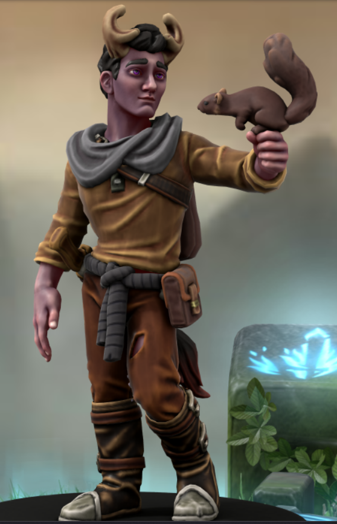

# Orbin Vlček
- #hráčskápostava
- Orbin je mladý tieflingský čaroděj divoké magie, který je součástí hlavní skupiny dobrodruhů v dobrodružství [Duchové Slaniska](Duchové_Slaniska.md).
- Nemá úplně nejvyšší sebevědomí. Sám si připadá, že není hoden svých magických schopností (vždyť přece ani sám neumí pořádně číst). Jeho sebevědomí rozhodně není podpořeno ani častými projevy divoké magie, které jeho kouzla doprovázejí.

- # Vzhled
	- Orbin je devatenáctiletý hubený tiefling střední výšky s lehce nafialovělou pletí, ze které se ale většinu snaží skrývat v dlouhých rukávech, nohavicích a vysokých kožených botách. Kolem pasu má omotaný opasek z dlouhého cáru černé látky. Na něm má za všech okolností připevněnou svou brašničku se surovinami, které nasbíral v divočině, a vedle ní hlavně také své milované dláto. To však často mívá i vytažené, aby si s ním mohl přehazovat mezi prsty. Kolem krku má omotanou svou kápi z šedé látky, kterou už však prakticky nikdy nenosí, jelikož již pár měsíců není schopna zakrýt jeho rohy vyrůstající z neupravených hnědých kudrnatých vlasů. Právě jeho rohy nejlépe definují Orbinovu postavu, kvůli jejich atypickému větvení podobnému tomu jaké je u srnců. Svůj tieflingský ocas nosí vždy poctivě zakasaný v kalhotách, aby co nejlépe zakryl jeho existenci.
	

- # Historie
	- Orbin se narodil a vyrůstal v malém městečku na Mečovém pobřeží zvaném Rawnis. Narodil se jako nejmladší dítě do předtím již čtyřčlenné rodiny lidí s primárně rybářskými kořeny.
	- Když mu bylo něco přes jeden rok, vážně onemocněl. Nikdo v Rawnisu nevěděl, jak Orbina vyléčit. Jeho matka se modlila ke všemu, co se dalo, aby Orbin tuto záhadnou nemoc překonal. A také se tak náhle stalo. *Sám však dodnes neví přesně za jakou cenu.*
	- Když vyrůstal, nikdy si moc nerozuměl se svými staršími sourozenci. jediné, co je spojovalo, byla nenávist k pirátům, jelikož jednou přepadli jejich otce, když byl rybařit a vzali mu jeho loďku spolu s veškerou výbavou. Sám si však naštěstí svůj život zachránit zvládl.
	- Nejraději se věnoval řemeslu, kterému se učil. Ke svému mistru v řezbářství Alartu Bartelovi vzhlížel nejspíše i více než k vlastnímu otci. V rámci svého učení se také stal důležitou součástí cechu [Vlnotvorců](Cech_Vlnotvorců.md), mezi kterými si vytvořil řadu známých, s nimiž rád trávil čas. Vždy se však kvůli svému postavení v cechu cítil být obecně na nižší úrovni než oni.
	- Po svých sedmnáctých narozeninách si začal všímat lehkých hrbolků na svém čele a zvláštních nafialovělých fleků na kůži trochu podobných modřinám. Nejdříve si z toho nic nedělal. Když se však hrbolky postupem času začaly proměňovat ve malé rohy, musel si nechat narůst delší vlasy, aby se zakryl. Věděl, že co se s ním děje není normální a že se nikdo nesmí dozvědět, čím si prochází. Stále častěji byl však cílem poznámek mířených na jeho zvláštní odstín pleti. Když se tedy asi o rok později plně vyučil, už byl pně rozhodnut, že v Rawnisu nemůže zůstat.
	- Sbalil si tedy pár věcí, včetně svého dláta, a utekl do blízkého lesa, kde měl v plánu žít v izolaci. Zde se živil čímkoli, co mohl najít.
	- Jednoho dne se Orbinovi zdál sen, že je ve svém lese, ale proplouvá mezi stromy, jako by byl schopen levitovat. Vyletěl tedy na nejbližší strom, kam se sedl na větev. Vedle něho čistou náhodou byla na větvi veverka. Nejdříve se Orbina bála a chtěla utéct, po chvíli se ale sama vrátila. Orbin jí tedy pojmenoval Čip. Po nějaké době hraní si s Čipem si řekl, že prokoumá les dále. Náhle asi došel ke zvláštnímu zjištění. O žádný sen se totiž nejednalo a on spolu se svou proměnou nejspíše získal i další schopnosti.
	- S Čipem přežívali v lese řadu měsíců, když o něho náhle přišel jedné noci kvůli hladovému medvědovi, který na ně náhle zaútočil. V Orbinovi se začal vařit vztek v takové míře, že se manifestoval ve formě ohnivé střely, kterou vyslal na toto divoké zvíře. Tím nejspíše zachránil svůj vlastní život, nezvládl ale už zachránit život svého jediného přítele.
	- Druhého dne ráno, když naplněný smutkem přecházel po lese, zaslechl dvě osoby, jak se baví o nějakém pašeráckém plánu spojeném s blízkým městečkem [Slaniskem](Slanisko.md). Jedniné, co si z jejich rozhovoru Orbin pořádně pamatuje je jméno [Skerrin](Skerrin.md). Ještě rozvířený emocemi z předchozí noci se rozhodl vyrazit do [Slaniska](Slanisko.md) a pomocí své magie zarazit jejich plány.
	- Předtím než však dorazil do samotného [Slaniska](Slanisko.md), narazil na zbytek své aktuální skupiny dobrodruhů, [Hetu](Heta.md), [Miguela](Miguel.md), [Kiviora](Kivior.md) a [Duplolase](Duplolas.md).

- # Kouzla
	- Orbin má každý svůj trik spojený s jistou vzpomínkou, získanou v období, kdy objevoval své nové magické schopnosti. Vždy když chce daný trik seslat, musí si nejdříve vybavit danou vzpomínku a pocity s ní spojené.
	- - **Ohnivá střela** - Z ohromného vzteku po ztrátě Čipa odehnal útočícího medvěda pomocí *ohnivé střely*
	- - **Útržek mysli** - Nevědomky pomocí *útržku mysli* udržoval "*přátelství*" s Čipem. Vždy když se Čip pokoušel utéct, začal se Orbin bát osamocení a přepadla ho panika, která ho přinutila vyslat na Čipa toto kouzlo.
	- - **Drobná iluze** - Chvíli poté, co objevil své čarodějné schopnosti, chtěl vyřezat sošku mořské panny. Vtom se vedle něho náhle objevila miniatura přesně taková, jakou zamýšlel. Iluze sice nejsou hmotné, ale i tak nadále používá *drobné iluze* primárně jako rozšíření své vlastní představivosti.
	- - **Mágova ruka** - Často chodil do části lesa, kde zjistil, že roste několik ovocných stromů. *Magická ruka* mu najednou pomáhala v situacích, kdy měl hlad, aby mu podala plody, jež byly mimo jeho dosah.

